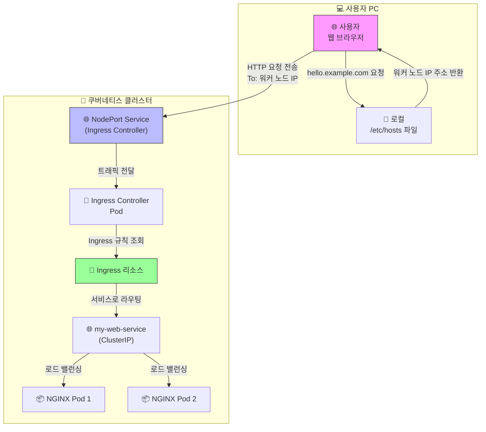

## 인그레스의 핵심 구조: 컨트롤러와 리소스

인그레스는 반드시 **두 가지 핵심 요소**가 함께 있어야 동작한다

1. **인그레스 컨트롤러 (Ingress Controller) 🧑‍🍳**
   - **역할**: 실제 트래픽을 받고 규칙에 따라 요청을 분배하는 **실행기(엔진)** Nginx, Traefik, HAProxy 등 다양한 종류가 있으며, 클러스터에 반드시 **하나 이상 설치되어 있어야 한다**
   - **비유**: 레시피를 보고 실제로 요리를 하는 **'셰프'**
2. **인그레스 리소스 (Ingress Resource) 📜**
   - **역할**: 사용자가 YAML 파일로 작성하는 **라우팅 규칙서** "어떤 도메인으로 요청이 오면 어떤 서비스로 보내라"는 내용이 담겨있다
   - **비유**: 셰프가 따라야 할 **'레시피'**

&nbsp;

## 최종 목표

 외부 인터넷 브라우저에서 `http://hello.example.com` 이라는 가상 도메인으로 접속했을 때, 우리가 만든 간단한 HTML 웹 페이지가 보이도록 만드는 것



&nbsp;

## 1. 웹 페이지 만들기 (ConfigMap)

먼저, 웹 서버가 보여줄 간단한 HTML 파일을 만들어야 한다 별도의 이미지를 빌드하지 않고, `ConfigMap`을 사용하여 HTML 코드를 클러스터에 직접 저장하는 방식을 사용

- **명령어의 역할:** 아래 YAML 파일은 `my-html`이라는 이름의 `ConfigMap`을 생성 이 `ConfigMap`은 `index.html`이라는 키(key)에 우리가 원하는 HTML 코드를 값(value)으로 저장
- **`web-configmap.yaml` 파일 작성:** 아래 내용으로 YAML 파일을 생성

``` yaml
apiVersion: v1
kind: ConfigMap
metadata:
  name: my-html
data:
  index.html: |
    <!DOCTYPE html>
    <html>
    <head>
      <title>Welcome to Kubernetes Ingress!</title>
      <style>
        body { font-family: sans-serif; text-align: center; margin-top: 100px; background-color: #f0f8ff; }
        h1 { color: #005a9c; }
        p { font-size: 1.2em; }
      </style>
    </head>
    <body>
      <h1>hello</h1>
      <p>success connecting!</p>
    </body>
    </html>
```

- **파일 적용:**

```bash
kubectl apply -f web-configmap.yaml
```

&nbsp;

### 2. 웹 서버 띄우기 (Deployment)

이제 위에서 만든 HTML 파일을 서빙할 NGINX 웹 서버를 `Deployment`를 통해 생성한다.

- **명령어의 역할:** `my-web-deployment`라는 이름의 `Deployment`를 생성 이 `Deployment`는 NGINX 컨테이너를 실행하며, 1단계에서 만든 `ConfigMap`을 볼륨(Volume)으로 마운트하여 NGINX의 기본 웹 페이지 경로(`/usr/share/nginx/html`)에 덮어씌운다
- **`web-deployment.yaml` 파일 작성:**

``` yaml
apiVersion: apps/v1
kind: Deployment
metadata:
  name: my-web-deployment
spec:
  replicas: 2 # 안정성을 위해 2개의 Pod을 실행합니다.
  selector:
    matchLabels:
      app: my-web
  template:
    metadata:
      labels:
        app: my-web
    spec:
      containers:
      - name: nginx
        image: nginx:latest
        ports:
        - containerPort: 80
        volumeMounts: # 컨테이너 내부에 볼륨을 연결(마운트)합니다.
        - name: html-volume
          mountPath: /usr/share/nginx/html
      volumes: # Pod이 사용할 볼륨을 정의합니다.
      - name: html-volume
        configMap:
          name: my-html # 'my-html' ConfigMap을 볼륨으로 사용합니다.
```

- 파일 적용:

```bash
kubectl apply -f web-deployment.yaml
```

<center></center>

&nbsp;

### 3. 내부 주소 부여하기 (Service)

`Deployment`의 Pod들은 언제든 죽고 새로 생성될 수 있어서 IP가 계속 바뀜 따라서 Ingress가 안정적으로 찾아갈 수 있도록 고정된 내부 주소를 가진 `Service`를 생성해야 한다

- **명령어의 역할:** `my-web-service`라는 이름의 `Service`를 생성 이 서비스는 `app: my-web`이라는 라벨을 가진 Pod들(2단계에서 만든 NGINX Pod들)을 찾아내고, 그들에게 `80`번 포트로 요청을 전달한다 `type: ClusterIP`는 이 서비스가 클러스터 내부에서만 사용됨을 의미

- **`web-service.yaml` 파일 작성:**

  ```yaml
  apiVersion: v1
  kind: Service
  metadata:
    name: my-web-service
  spec:
    selector:
      app: my-web # 이 라벨을 가진 Pod을 찾습니다.
    ports:
      - protocol: TCP
        port: 80 # 서비스 자체의 포트
        targetPort: 80 # Pod의 컨테이너 포트
    type: ClusterIP
  ```

- **파일 적용:**

```bash
kubectl apply -f web-service.yaml
```

<center></center>

&nbsp;

### 4. Ingress Controller 설치하기

이제 외부 요청을 받아줄 '경비원', 즉 NGINX Ingress Controller를 설치한다

- **명령어의 역할:** 아래 `apply` 명령어는 NGINX Ingress Controller 공식 GitHub에 있는 YAML 파일을 통해 설치를 진행 이 파일은 `ingress-nginx` 네임스페이스를 만들고, 그 안에 Controller `Deployment`, `Service`, 각종 권한 설정(RBAC) 등을 자동으로 생성한다

- **설치 명령어:**

  ```bash
  kubectl apply -f https://raw.githubusercontent.com/kubernetes/ingress-nginx/controller-v1.10.1/deploy/static/provider/baremetal/deploy.yaml
  ```

- **외부 접속 포트 확인:** 설치 후, `ingress-nginx` 네임스페이스의 서비스를 확인하여 외부 접속 포트(`NodePort`)를 알아내야 한다(자동 설정했기 때문에)

  ```bash
  kubectl get service -n ingress-nginx
  ```

  <center></center>

  결과에서 `ingress-nginx-controller` 서비스의 `PORT(S)` 부분을 확인 `80:32096/TCP` 와 같이 표시된 부분에서 **32096**가 우리가 사용할 포트 번호이다 32096으로 들어오는것을 80으로 보낸다 의미

&nbsp;

### 5. 안내판 세우기 (Ingress)

드디어 "https://=hello.example.com:32096으로 온 요청은 my-web-service로 보내라"는 규칙을 담은 `Ingress` 리소스를 생성

- **명령어의 역할:** `my-web-ingress`라는 이름의 `Ingress`를 생성 `ingressClassName: nginx`는 이 규칙을 NGINX Ingress Controller가 처리해야 함을 명시한다 `host`와 `path` 규칙에 따라 들어온 요청을 `my-web-service`의 `80`번 포트로 전달

- **`web-ingress.yaml` 파일 작성:**

  ```yaml
  apiVersion: networking.k8s.io/v1
  kind: Ingress
  metadata:
    name: my-web-ingress
  spec:
    ingressClassName: nginx # NGINX Ingress Controller를 사용
    rules:
    - host: "hello.example.com"
      http:
        paths:
        - path: /
          pathType: Prefix
          backend:
            service:
              name: my-web-service # 3단계에서 만든 서비스 이름
              port:
                number: 80 # 서비스의 포트 번호
  ```

- **파일 적용:**

```bash
kubectl apply -f web-ingress.yaml
```

<center></center>

&nbsp;

### 6. 외부와 연결하기 (`hosts` 파일 수정)

마지막으로, 내 컴퓨터의 웹 브라우저가 `hello.example.com`이라는 도메인을 어디로 찾아가야 할지 알려줘야 한다 인터넷에는 존재하지 않는 주소이므로, 내 컴퓨터의 `hosts` 파일을 수정하여 직접 지정

- **명령어의 역할:** `hosts` 파일에 `<워커노드_IP> hello.example.com` 라인을 추가하면, 내 컴퓨터는 이 도메인에 대한 요청을 인터넷 DNS에 묻지 않고 지정된 IP로 즉시 보낸다

- **수정 방법:**

  1. **워커 노드 IP 확인:** `kubectl get nodes -o wide` 명령어로 워커 노드 중 하나의 `INTERNAL-IP`를 확인
     <center></center>
  
  2. **`hosts` 파일 열기:** 관리자 권한으로 파일연다
  
     - **Linux / macOS:** `sudo nano /etc/hosts`
     - **Windows:** 메모장을 '관리자 권한으로 실행'한 후 `C:\Windows\System32\drivers\etc\hosts` 파일 수정

  3. **내용 추가:** 파일 맨 아래에 다음 라인을 추가하고 저장 `<워커노드_IP>` 부분은 1번에서 확인한 실제 IP로 변경해야 한다
  
     ```bash
     <워커노드_IP>  hello.example.com
     # 예시: 192.168.56.11  hello.example.com
     ```

&nbsp;

### 최종 확인

이제 웹 브라우저를 열고 주소창에 아래 주소를 입력

> [**http://hello.example.com:32096**](https://www.google.com/search?q=http://hello.example.com)

<center></center>
