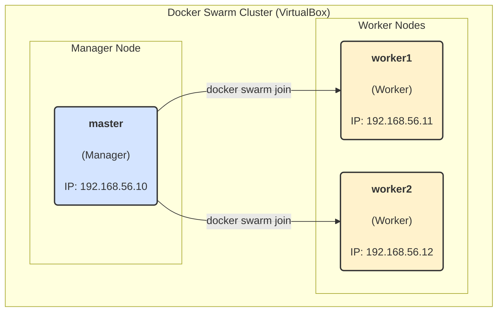

## Docker Swarm 클러스터 구축 및 관리

### 컨테이너 오케스트레이션과 Docker Swarm

Docker Swarm은 여러 Docker 호스트를 하나의 클러스터로 묶어 관리하는 컨테이너 오케스트레이션 도구

컨테이너 오케스트레이션 도구는 다수의 호스트에 걸쳐 컨테이너의 배포, 관리, 확장, 네트워킹을 자동화하는 역할을 수행함. 도구 없이는 어느 호스트에 어떤 컨테이너를 배치할지, 호스트 간 통신은 어떻게 제어할지 등을 직접 관리해야 하는 복잡성이 있다

Swarm을 도입하면 이러한 관리 비용을 절감하고, 여러 호스트를 마치 하나의 거대한 Docker 호스트처럼 투명하게 다룰 수 있다

&nbsp;

### Docker 생태계 내 도구 구분

| 도구        | 주요 역할                                                 | 대상 환경   | 관련 명령어      |
| ----------- | --------------------------------------------------------- | ----------- | ---------------- |
| **Compose** | 여러 컨테이너로 구성된 애플리케이션 정의 및 관리          | 단일 호스트 | `docker-compose` |
| **Swarm**   | 여러 호스트를 묶어 클러스터 구축 및 관리                  | 다중 호스트 | `docker swarm`   |
| **Service** | Swarm 클러스터 내에서 동작하는 컨테이너의 집합(작업) 관리 | 다중 호스트 | `docker service` |
| **Stack**   | 여러 서비스로 구성된 전체 애플리케이션 스택 관리          | 다중 호스트 | `docker stack`   |

&nbsp;

### Docker Swarm 아키텍처 및 주요 기능

#### 역할 기반 아키텍처

Swarm 클러스터는 역할을 기준으로 **매니저 노드(Manager Node)**와 **워커 노드(Worker Node)**로 구성됨

- **매니저 노드 (Manager Node)**
  - 클러스터의 상태 유지, 컨테이너 스케줄링, 서비스 관리 등 전체 클러스터 제어
  - 다중 매니저 구성 시, 그중 하나가 **리더(Leader)**가 되어 나머지 매니저와 워커를 관리함
  - 기본적으로 워커의 역할(컨테이너 실행)도 겸할 수 있음
  - **[참고]** 쿠버네티스의 마스터 노드는 기본적으로 관리 역할만 수행하지만, Swarm 매니저 노드는 서비스 컨테이너 실행이 가능함. 관리 노드의 부하를 줄이려면, 아래 옵션으로 서비스 컨테이너를 실행하지 않도록 제한하는 것을 권장

``` shell
# 매니저 노드가 아닌 곳에만 서비스를 배포하는 제약 조건
docker service create --constraint node.role != manager <이미지명>
```

- **워커 노드 (Worker Node)**
  - 매니저의 지시를 받아 실제 컨테이너(Task)를 실행하는 역할만 수행

&nbsp;

#### 주요 기능

- **서비스 확장 및 상태 조정 (Scaling & Reconciliation)**
  - 서비스 생성 시 `--replicas` 옵션으로 복제본 수를 지정하여 안정성을 확보
  - 매니저 노드는 지속적으로 서비스 상태를 모니터링함 컨테이너에 장애가 발생하면, 사용자가 요청한 상태(`replicas` 수)를 유지하기 위해 자동으로 새로운 복제본을 생성 (요구 상태 관리, Desired State Reconciliation)
- **서비스 스케줄링 (Scheduling)**
  - 클러스터 내 노드에 서비스 컨테이너를 배포하는 작업
  - **고가용성 분산 알고리즘(HA Spread Algorithm)**을 사용 서비스 복제본을 분산 배포하기 위해 현재 복제본이 가장 적은 노드를 우선 선택
- **내장 로드 밸런싱 (Routing Mesh)**
  - Swarm 초기화 시 `ingress`라는 오버레이 네트워크가 자동으로 생성됨
  - 서비스의 포트를 외부에 노출(`--publish`)하면, Swarm 클러스터의 **모든 노드**에 해당 포트가 열림
  - 클라이언트가 **어떤 노드의 IP로 접속하더라도** Swarm은 요청을 실제 서비스 컨테이너가 실행 중인 노드로 알아서 전달(라우팅)함. 이를 **라우팅 메시(Routing Mesh)**라고 함
- **서비스 검색 (Service Discovery)**
  - Swarm은 내장 DNS 서버를 통해 서비스 검색 기능을 제공
  - 클러스터 내의 컨테이너는 다른 서비스의 컨테이너에 접근할 때, IP 주소가 아닌 **서비스 이름**을 호스트명처럼 사용하여 통신할 수 있음
- **롤링 업데이트 (Rolling Update)**
  - 서비스 업데이트 시 무중단 배포를 위해, 노드 단위로 점진적인 업데이트를 수행함
  - 새 버전 컨테이너를 하나씩 배포하고, 이전 버전 컨테이너를 하나씩 제거하는 방식
  - 업데이트 실패 시 재시도, 중지, 롤백 기능을 제공하여 안정적인 운영을 지원

&nbsp;

### VirtualBox를 이용한 Swarm 클러스터 구축 실습

#### 구조



&nbsp;

#### 1. 클러스터 구성 및 vm 생성

난 vagrant를 이용해서 3개를 동시에 만들었다

``` sh
# -*- mode: ruby -*-
# vi: set ft=ruby :

Vagrant.configure("2") do |config|

  # --- 'master' 노드 정의 ---
  config.vm.define "master" do |m|
    # Box를 ubuntu/jammy64로 설정
    m.vm.box = "ubuntu/jammy64"
    m.vm.hostname = "master"
    m.vm.network "private_network", ip: "192.168.56.10"

    m.vm.provider "virtualbox" do |vb|
      vb.name = "master"
      vb.memory = "2048"
      vb.cpus = "2"
    end
  end
  
  # --- 첫 번째 워커 노드 정의 (worker1) ---
  config.vm.define "worker1" do |w1|
    # Box를 ubuntu/jammy64로 설정
    w1.vm.box = "ubuntu/jammy64"
    w1.vm.hostname = "worker1"
    w1.vm.network "private_network", ip: "192.168.56.11"

    w1.vm.provider "virtualbox" do |vb|
      vb.name = "worker1"
      vb.memory = "2048"
      vb.cpus = "2"
    end
  end

  # --- 두 번째 워커 노드 정의 (worker2) ---
  config.vm.define "worker2" do |w2|
    # Box를 ubuntu/jammy64로 설정
    w2.vm.box = "ubuntu/jammy64"
    w2.vm.hostname = "worker2"
    w2.vm.network "private_network", ip: "192.168.56.12"

    w2.vm.provider "virtualbox" do |vb|
      vb.name = "worker2"
      vb.memory = "2048"
      vb.cpus = "2"
    end
  end

end
```

&nbsp;

| 역할     | 호스트명 | IP 주소         |
| -------- | -------- | --------------- |
| Manager  | Master   | `192.168.56.10` |
| Worker 1 | worker1  | `192.168.56.11` |
| Worker 2 | worker2  | `192.168.56.12` |

**네트워크 어댑터 설정**: 각 가상머신의 설정으로 이동하여 네트워크 어댑터를 2개 설정.

- **어댑터 1**: `다음에 연결됨:`을 **내부 네트워크(Internal Network)**로 설정하고, 3대의 VM 모두 동일한 이름을 사용해야 함 이 어댑터는 Swarm 노드 간 통신에 사용 (내부 통신 용도)
- **어댑터 2**: `다음에 연결됨:`을 **NAT**로 설정 이 어댑터는 각 VM이 인터넷에 접속하여 패키지를 다운로드하는 데 사용

&nbsp;

#### 2. Docker 설치 (모든 노드)

``` shell
# 필수 패키지 설치
sudo apt update
sudo apt install -y ca-certificates curl

#Docker 공식 GPG 키 추가
sudo install -m 0755 -d /etc/apt/keyrings
sudo curl -fsSL https://download.docker.com/linux/ubuntu/gpg -o /etc/apt/keyrings/docker.asc
sudo chmod a+r /etc/apt/keyrings/docker.asc

#Docker 레포지토리 추가
echo \
  "deb [arch=$(dpkg --print-architecture) signed-by=/etc/apt/keyrings/docker.asc] https://download.docker.com/linux/ubuntu \
  $(. /etc/os-release && echo "$VERSION_CODENAME") stable" | \
  sudo tee /etc/apt/sources.list.d/docker.list > /dev/null
  
#Docker 엔진 설치
sudo apt update
sudo apt install -y docker-ce docker-ce-cli containerd.io docker-buildx-plugin docker-compose-plugin

#Docker 서비스 시작 및 권한 설정
sudo systemctl start docker
sudo systemctl enable docker
# 현재 사용자를 docker 그룹에 추가 (sudo 없이 docker 명령어 사용)
sudo usermod -aG docker $(whoami)
```

&nbsp;

#### 3. Swarm 클러스터 초기화 및 노드 참여

1. **매니저 노드에서 Swarm 초기화**

   - `swarm-manager` 노드에서 아래 명령어 실행. `--advertise-addr` 옵션에 매니저 자신의 내부 IP를 지정

     ```
     docker swarm init --advertise-addr 192.168.56.10
     ```

   - 실행 결과로 워커 노드가 참여(join)할 때 필요한 토큰이 포함된 명령어가 출력됨. 이 명령어를 복사

   <center></center>

2. **워커 노드에서 Swarm 참여**

   - `swarm-worker1`과 `swarm-worker2` 노드에서 위에서 복사한 `docker swarm join ...` 명령어를 그대로 붙여넣고 실행
   - "This node joined a swarm as a worker." 메시지가 출력되면 성공

   <center></center>

3. **클러스터 상태 확인**

   - `swarm-manager` 노드에서 아래 명령어로 클러스터에 포함된 모든 노드의 상태를 확인

     ```
     docker node ls
     ```

   - 3개 노드가 모두 `Ready` 상태로 보이면 클러스터 구성 완료
   
   <center></center>

&nbsp;

#### 4. 방화벽 포트 설정 (모든 노드)

Swarm 노드 간 원활한 통신을 위해 방화벽(`ufw`)에서 특정 포트를 허용해야 함

``` shell
# 클러스터 관리 통신 포트
sudo ufw allow 2377/tcp
# 노드 간 통신 포트
sudo ufw allow 7946/tcp
sudo ufw allow 7946/udp
# 오버레이 네트워크(Ingress 포함) 통신 포트
sudo ufw allow 4789/udp

# SSH 접속을 위한 포트 (필요 시)
sudo ufw allow 22/tcp

# 방화벽 활성화
sudo ufw enable
```

&nbsp;

**다중 노드 클러스터 구축 경험**: VirtualBox 가상화 환경에서 여러 가상머신을 생성하고, 네트워크 설정부터 Docker 설치, Swarm 클러스터 구성까지 전 과정을 직접 수행하여 실무 역량을 강화

**Swarm 핵심 기능 검증**: 매니저와 워커 노드의 역할을 이해하고, `docker node ls`와 같은 명령어를 통해 클러스터가 정상적으로 구성되었는지 확인