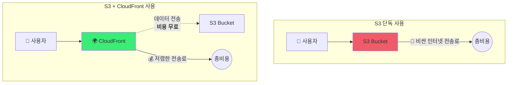

AWS를 공부하기 위해서 도서관에서 기본이 되는 책을 읽어 봤다 책의 이름은 그림으로 이해하는 AWS 구조와 기술로 내용으로는 클라우드의 기본 개념과 AWS를 이해하기 위한 네트워크 구조 마지막으로 AWS의 대표적인 서비스에 대해서 작성한 책었다

1~3장까지는 AWS의 기초 지식으로 왜 클라우드를 왜 사용하는지 사용 방법, 도입 사례가 있었다 그래서 작성은 패스

&nbsp;

## 4장 EC2

EC2란 elastic compute cloud로 서버에 필요한 세트를 클라우드에서 빌릴 수 있다

EC2는 *매니지드 서비스*(사용자가 설치하고 운영해야 한다)가 아니다 매니지드 서비스란 단어를 들어는 봤지만 크게 생각을 안해 봤었는데 여기서 정확한 뜻을 알았다 

EC2로 생성한 서버 **인스턴스**는 여러 유형이 존재한다

`t2(인스턴스 유형).micro(인스턴스 크기)`

|          용도          | 인스턴스 유형 |                            내용                            |
| :--------------------: | :-----------: | :--------------------------------------------------------: |
|          범용          | T2,T3,M5,M4등 | 일반적인 서버로 부하가 일정한 서버인 경우 사용 버스트 가능 |
|     컴퓨팅 최적화      |    C5,C4등    |                  CPU특화 연산 능력이 높음                  |
|     메모리 최적화      |   X1e,X1등    |               메모리 액세스 속도를 높인 서버               |
|     메모리 최적화      |      R4       |                 대용량 메모리 탑재한 서버                  |
| 가속한된 컴퓨팅 최적화 |  P3,P2,G3,F1  |               머신 러닝등에 사용 GPU를 탑재                |
|    스토리지 최적화     |  H1,I3,D2등   |              스토리지 최적화한 유형 I3는 SSD               |

&nbsp;

### EBS(Elastic Block Store)

EC2 인스턴스를 실행할 때 연결되는 스토리지이다 SSD, HDD 설정가능하다 EBS는 하나의 EC2에만 연결이 가능하다 이외에도 탄력적 볼륨(크키 간단히 조절), 스냅샷(특정 시점의 데이터 통째로 저장), 암호화등이 존재한다

&nbsp;

### ELB(Elastic Load Balancing)

부하를 분산시키는 **부하 분산 장치** 3가지 종류가 있다

- ALB(Application Load Balancer): HTTP/HTTPS에 가장 적합한 로드 밸런서로 어플리케이션 계층에서 동작한다
  URL 간위로 분배하는것이 가능
- NLB(Network Load Balancing): 전송계층(4계층)에서 작동하기 때문에 패킷이라는 단편 데이터만 볼 수 있다
  TCP/UCP, TLS지원 
- CLB(Classic Load Balancing): 오래된 유형의 로드 밸런서 지원 프로토콜이 많지만 사용 거의 x

&nbsp;

### 스냅샷

어던 시점의 서버 디스크 산태를 통째로 보존한 파일이나 폴더들의 집합이다 os설정 정보까지 모두 포함한다

개인이 AWS에서 AMI를 만들기 위해서 스냅샷을 사용하기도 한다 처음에만 통째로 저장하지만 두번째부터는 변경사항만 보존한다

&nbsp;

### 오토 스케일링

오토 스케일링 그룹(인스턴스 집합)을 생성하고 인스턴스의 최소 대수와 최대 대수를 설정한다 그러면 그 범위 안에서 인스턴스가 증감한다

AMI와 키페어, 보안 그룹등을 설정해야한다

1. EC2 인스턴스가 정지한 경우에 분리하고 새로운 EC2인스턴스를 생성하는 방법
2. 일정에 맞춰 스케일링하는 방법
3. CPU와 네트워크 부하를 참고하여 특정 임계값을 넘어갈 때 인스턴수 증감

&nbsp;

### EC2요금

인스턴스 사용량 + EBS 요금 + 통신 요금 + 그외 옵션(Elastic IP, ELB등)의 비용이 같이 계산한다

&nbsp;

## 5장 스토리지 서비스 S3

S3란 객체 스토리지 서비스이고 데이터를 객체 단위로 관리한다 대표적 지는으로 **웹서버 기능, 쿼리 기능**이 있다

&nbsp;

### 스토리지 클래스

- standard: 3곳의 가용 영역에 데이터 저장, 검색 요금이 없다
  - Reduced Redundancy Storage(RRS)는 옵션으로 standard에서 이중화 수준을 낮춰 하나의 가용 영역만 이용
- Intelligent-Tiering: 2개의 게층이 존재 액세스가 빈번한지에 따라 자동으로 분류한다 2개의 액세스 계층 이동하는데 비용 x, 기본적으로 standard와 비슷하지만 최소 저장 기산에 대한 요금 설정됨
- Standard-Infrequent Access: 저장 요금이 싸지만 액세스 요금이 부과, 액세스 적고 요량이 큰 데이터 적합
- S3 Glacier/S3 Glacier Deep Archive:  장기간 백업 데이터 낮은 용량으로 저장 액세스시 다른 S3 버킷에 이동해서 액세스 하므로 검색 요금이 2배

&nbsp;

### 객체와 버킷

버킷안에 버킷이 불가능하다 폴더 개념이 없다 웹에서 폴더 구조를 보여주지만 사실은 **병렬로 저장**된다

버킷 이름은 `소문자` + `.` + `숫자`조합으로 사용하고 ip주소형식이나 중복된 이름은 불가능하다

&nbsp;

### 데이터 분석

S3의 객체나 객체 내용에 대해서 분석할 수 있다

- S3 Select: S3로 저장된 하나의 파일에 SQL문을 사용하여 집계 및 검색
- Athena: 어떤 대상에 대해 어떤 검색을 할지 사전에 구성해야한다(여러 파일 분석 가능) **서버 없이 실행할 때만 비용**
- Redshift Spectrum: Athena와 비슷하지만 분석용 서버를 따로 만들어서 분석한다 복잡한 데이터를 처리할 때 사용

&nbsp;

### CloudFront

&nbsp;

### 요금

요금은 스토리지 종류와 지전에 따라 다르지만 **저장 요량 + 전송량**으로 계산한다 저장된 용량과 S3에서 파일을 받거나 보낼 때 발생하느 요금 수신 요청 (get) 송신요청 (put)에 대해서 1GB단위로 과금된다
